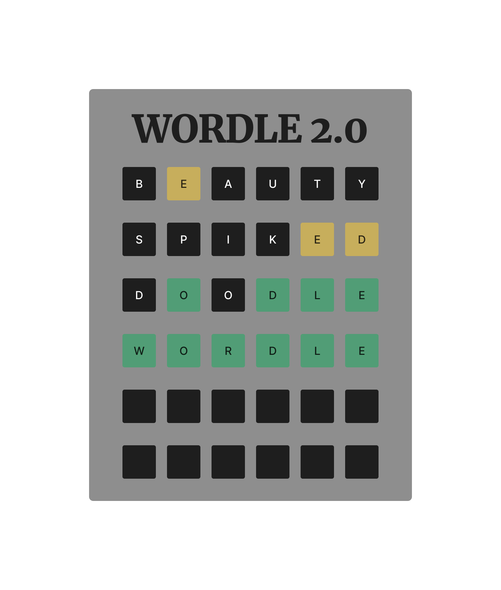

:warning: Everything between << >> needs to be replaced (remove << >> after replacing)

#  Wordle
## CS110 Final Project   1st semester, 1st year 

## Team Members
Melvin Zhou, Sky Jiang

***
## Project Description
Making Wordle 
    - The player has 6 attempts to guess a 6 letter word
    - When the player guesses a word the letters will change colors to signify if the letter is in the word and in the right position, in the word but in the wrong position or not in the word
***    

## GUI Design

### Initial Design

### Final Design

## Program Design

### Features

1. Start and end screen
2. hints through colored words after guess
3. letters that can be typed and displayed
4. Screen explaining rules
5. Retry button

### Classes

- Controller: Where all the code is and is run from

## ATP

